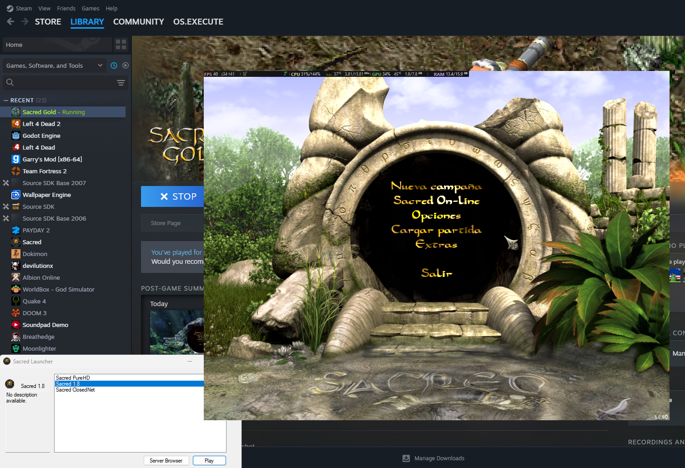

# Sacred Launcher
A lightweight and simple unofficial launcher for Sacred (2004), designed to be used with Steam.

This was created to solve a really basic but tedious issue: having to rename and move files so Steam could track the hours you played in.

## Dependencies
- .NET Framework 4.7.2 (Generally comes pre-installed)

That's pretty much it.

## How to use
1. Download the latest release of Sacred Launcher in the **Releases** tab.
2. Insert the content of the zip file in your root directory of Sacred.
3. Rename the original **Sacred.exe** to anything else (**DO NOT delete it**), and rename **Sacred-Launcher.exe** to **Sacred.exe**.

That's it! You can now execute it using Steam and add the paths of your mods or other versions of the game inside the launcher.

## Data saved by Sacred Launcher
Everything is saved in the `data.json` file, except for the server list, which is saved in `servers.json`.
